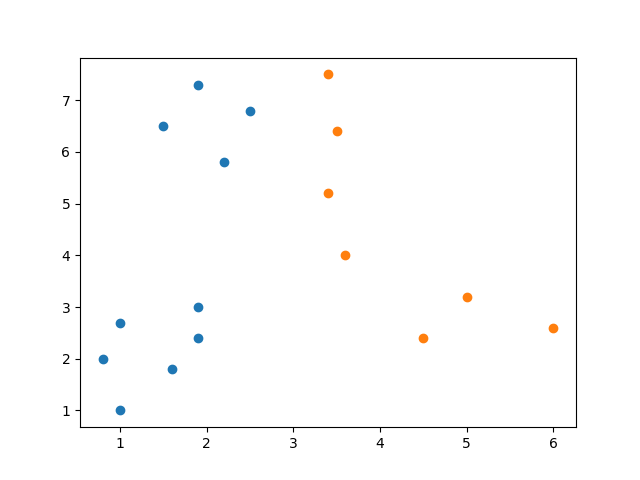

## This project is in beta

The algorithms of this project is still in beta, so it does not guarantee that the results will be eficient or correct. Depending on the inputs they receive, they can go into traps.

# A genetic algorithm and K-means algorithm for data clustering

This project is two algorithms implementation for clustering data:

1. A genetic algorithm
2. K-means algorithm

## Data input format

	# This is a comment line, them ignored by the program
	[point1-x] [point1-y]
	[point2-x] [point2-y]
	...

## Data output format

	[point1-cluster-id] [point1-x] [point1-y]
	[point2-cluster-id] [point2-x] [point2-y]
	...

The cluster ID is one-based index.

## Running the program

The genetic algorithm is the program ``clustering-genetic.py``, and the K-means is ``clustering-kmeans.py``

Running the algorithm (e.g. the K-means):

```bash
python clustering-kmeans.py [number-of-clusters] < input.txt
```

This project has some ``.txt`` examples of dataset input.

### Example

Running:

```bash
python clustering-genetic.py 2 < input-file.txt
```

Content of ``input-file.txt``:
```
1.9   7.3
3.4   7.5
2.5   6.8
1.5   6.5
3.5   6.4
2.2   5.8
3.4   5.2
3.6   4
5     3.2
4.5   2.4
6     2.6
1.9   3
1     2.7
1.9   2.4
0.8   2
1.6   1.8
1     1
```

It will run the Genetic Algorithm for 2 clusters.

Output:
```
#	Cluster		X		Y
 	2		1.900000		7.300000
 	1		3.400000		7.500000
 	1		2.500000		6.800000
 	1		1.500000		6.500000
 	2		3.500000		6.400000
 	1		2.200000		5.800000
 	2		3.400000		5.200000
 	1		3.600000		4.000000
 	2		5.000000		3.200000
 	2		4.500000		2.400000
 	1		6.000000		2.600000
 	1		1.900000		3.000000
 	2		1.000000		2.700000
 	1		1.900000		2.400000
 	1		0.800000		2.000000
 	1		1.600000		1.800000
 	2		1.000000		1.000000
```

## Graph visualization of the result

This project also has a program that receives an output of the algorithms (clustered data) in its input (where lines started with ``#`` are comments then ignored). Then it plots a visualization of the clustered data.

To run the algorithm, then plot the output, pipe to the ``plot.py`` program: (e.g. run K-means)

```bash
python clustering-kmeans.py [number-of-clusters] < input.txt | python plot.py
```

### Required installations

These are the installations steps required to run the plots.

\*\* These steps are using **Linux** operating system.

1. Install Python PIP: (if not installed)

```bash
sudo apt-get install python-pip
```

2. Install Matplotlib library: (if not installed)

```bash
python -m pip install matplotlib
```

3. Install Python Tkinter: (if not installed)

```bash
sudo apt-get install python-tk
```

### Example

Run:

```bash
python clustering-kmeans.py 2 < sample-in-02.txt | python plot.py
```

Where ``sample-in-02.txt`` content is:
```
1.9   7.3
3.4   7.5
2.5   6.8
1.5   6.5
3.5   6.4
2.2   5.8
3.4   5.2
3.6   4
5     3.2
4.5   2.4
6     2.6
1.9   3
1     2.7
1.9   2.4
0.8   2
1.6   1.8
1     1
```

Running the K-means for 2 clusters, will output:

 